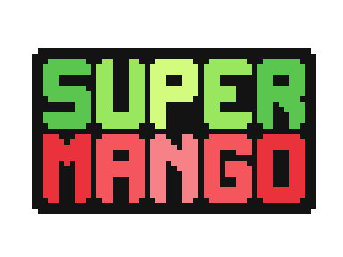

<p align="center">
  <a href="" rel="noopener">
 </a>
</p>

<h3 align="center">Mario-like Platformer</h3>

<div align="center">

<!-- []()
[](https://github.com/kylelobo/The-Documentation-Compendium/issues)
[](https://github.com/kylelobo/The-Documentation-Compendium/pulls)
[](/LICENSE) -->

</div>

---

<p align="center"> My first web game project with Javascript.
    <br> 
</p>

## 📝 Table of Contents

- [About](#about)
- [Getting Started](#getting_started)
- [Usage](#usage)
- [Built Using](#built_using)
- [Authors](#authors)
- [Acknowledgments](#acknowledgement)

## ✨ About <a name = "about"></a>

This is my first personal web project and I decided to create a game. Inspired by the classic Super Mario game and 2000s gameboy trend, I attempted to build a platformer that has similar navigation and added some personal features.

## 🏁 Getting Started <a name = "getting_started"></a>

These instructions will get you a copy of the project up and running on your local machine for development and testing purposes. See [deployment](#deployment) for notes on how to deploy the project on a live system.

### Prerequisites

Basically, if you have VS Code installed, you should install `Liver server`extension and that's all needed


### Installing

+ Clone the project to your local directory

```bash
git clone https://github.com/...
```

+ Open the project in VS Code and run live server, or run the project with a server

+ :warning: You may have to adjust the url shortener depending on your folder structure.("./" **&harr;** "../") if any error occurs.

> All required assets are included in this repository.


## 🎈 Usage <a name="usage"></a>

Run the project and navigate by keyboards as instructions on the screen.

## 🚀 Deployment <a name = "deployment"></a>

You can load the whole folder and deploy it through hosting services.

## ⛏️ Built Using <a name = "built_using"></a>

- [KaboomJS](https://kaboomjs.com/) - Kaboom Javascript library
- [JuhoSprite](https://juhosprite.itch.io/super-mango-2d-pixelart-platformer-asset-pack16x16) - Asset base package

## ✍️ Authors <a name = "authors"></a>

- [@tuci31203](https://github.com/tuci31203) - Chien

## 🎉 Acknowledgements <a name = "acknowledgement"></a>

- Original - [@JSLegend](https://github.com/JSLegendDev)
- Many thanks to my instructor - M.S Bui Trong Tung

